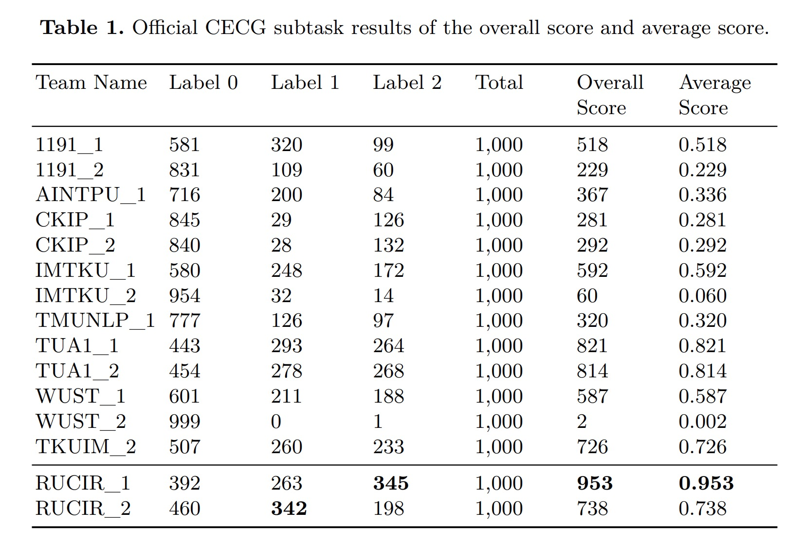

# NTCIR14-STC3-CECG-RUCIR

This is a page for RUCIR in NTCIR14 STC3 CECG Task.

### Introduce

[NTCIR14](http://research.nii.ac.jp/ntcir/ntcir-14/index.html) - The 14th NII Testbeds and Community for Information access Research 

[STC3](http://sakailab.com/ntcir14stc3/) - Short Text Conversation Task

[CECG](http://coai.cs.tsinghua.edu.cn/hml/challenge/) - Chinese Emotional Conversation Generation Subtask

### Results

### Publications

*Yaoqin Zhang and Minlie Huang* **Overview of the NTCIR-14 Short Text Generation Subtask: Emotion Generation Challenge** [Link](http://research.nii.ac.jp/ntcir/workshop/OnlineProceedings14/pdf/ntcir/02-NTCIR14-OV-STC-ZhangY.pdf)

***Xiaohe Li*** *, Jiaqing Liu, Weihao Zheng, Xiangbo Wang, Yutao Zhu and Zhicheng Dou* **RUCIR at NTCIR-14 STC-3 Task** *, Proceedings of the 14th NTCIR Conference*. 2019. [Link](http://research.nii.ac.jp/ntcir/workshop/OnlineProceedings14/pdf/ntcir/14-NTCIR14-STC-LiX.pdf)

